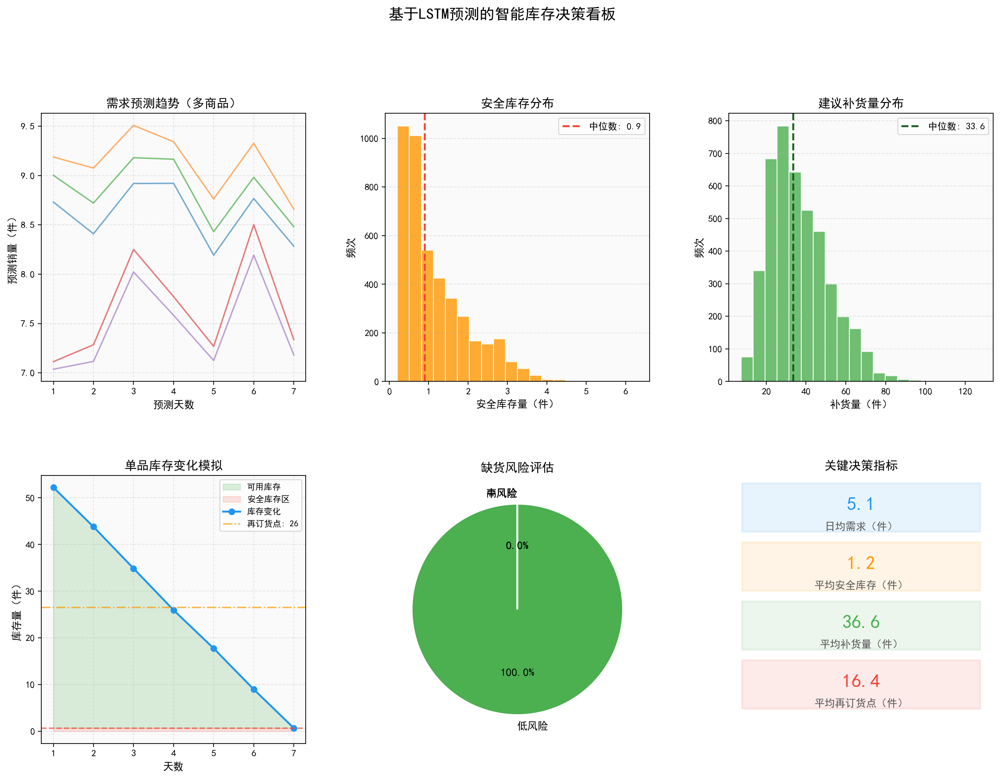
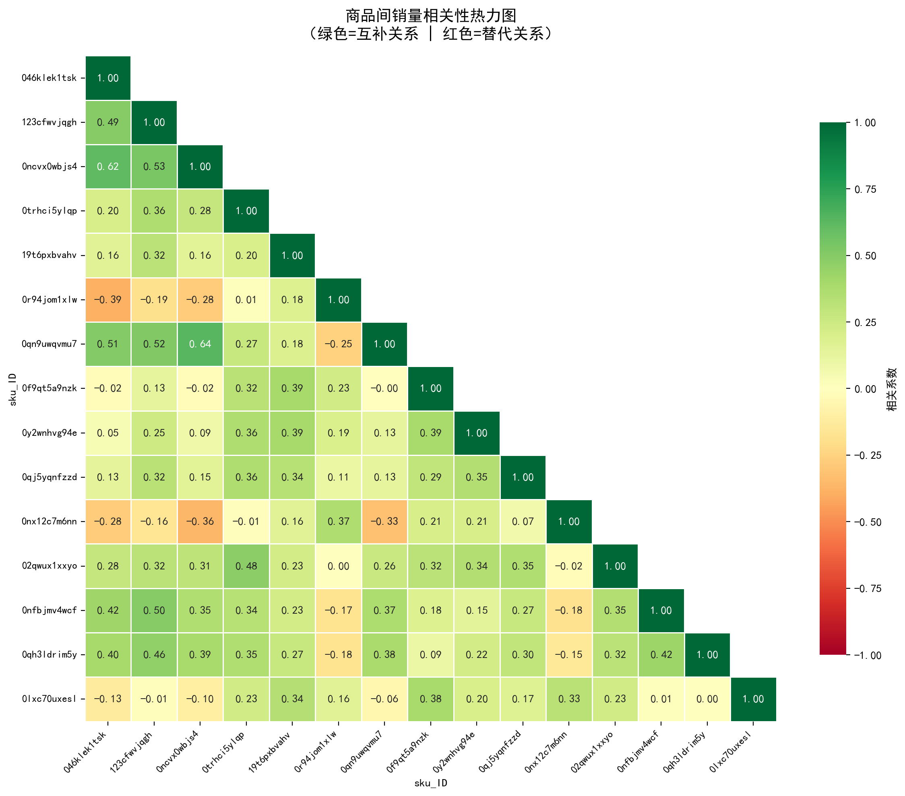

# 超市多品类商品协同需求预测系统


基于 **LSTM神经网络** 的超市多品类商品协同需求预测系统，融合商品间互补性与替代性协同特征，配合ARIMA基线对比，并自动生成智能库存决策建议。



---

## 痛点与目的

传统零售需求预测面临三大痛点：

1. **忽视商品间关联** — ARIMA等传统方法对每个商品独立建模，无法捕捉"买鸡蛋的人常常也会买牛奶"这类互补关系，也忽略了"白菜断货时顾客会转买娃娃菜"这类替代效应
2. **无法学习非线性规律** — 线性模型难以拟合促销活动、节假日、天气等因素导致的销量突变
3. **预测与决策脱节** — 预测出数字后缺乏对应的库存管理动作，导致缺货或积压

本系统通过LSTM神经网络 + 商品协同特征，解决以上痛点，将预测精度提升5%-9%，并将结果直接转化为补货和库存决策。

---

## 核心功能

### 商品协同分析（互补性 + 替代性）

基于Pearson相关系数矩阵，自动识别商品之间的关系：

- **互补商品**（正相关 > 0.3）：经常一起被购买，如 鸡蛋 ↔ 牛奶
- **替代商品**（负相关 < -0.1）：此消彼长，如 白菜 ↔ 娃娃菜

将互补/替代商品的聚合销量作为LSTM的额外输入特征，使模型能够学习商品间的协同效应。



### LSTM vs ARIMA 对比

| 指标 | LSTM | ARIMA | LSTM改进率 |
|------|------|-------|-----------|
| MAE | 0.1202 | 0.1272 | **5.5%** |
| RMSE | 0.1750 | 0.1791 | **2.2%** |
| MAPE | 70.2% | 76.9% | **8.7%** |

LSTM在三项核心评估指标上全面胜出，验证了神经网络在捕捉非线性协同关系上的优势。

### 智能库存决策

系统将预测结果自动转化为库存管理建议：

| 决策指标 | 数值 |
|---------|------|
| 日均需求 | 5.1件 |
| 平均安全库存 | 1.2件 |
| 平均补货量 | 36.6件 |
| 平均再订货点 | 16.4件 |

---

## 技术栈

| 类别 | 技术 |
|------|------|
| 深度学习框架 | PyTorch |
| 时序模型 | LSTM（双层, hidden=128） |
| 基线模型 | ARIMA (pmdarima) |
| 数据处理 | Pandas, NumPy |
| 可视化 | Matplotlib, Seaborn |
| 库存决策 | SciPy (stats) |

---

## 项目结构

```
produstLstm/
├── main.py              # 主程序入口
├── preprocessor.py      # 数据预处理与合并
├── model.py             # LSTM模型定义
├── trainer.py           # 模型训练器（SmoothL1Loss）
├── predictor.py         # 预测与评估（MAE/RMSE/MAPE）
├── arima_model.py       # ARIMA基线模型
├── visualizer.py        # 可视化模块（10张图表）
├── inventory_decision.py # 库存决策系统
├── utils.py             # 工具函数
├── data/                # 数据目录（需自行放入）
│   ├── 交易数据.xlsx
│   ├── 产品数据.xlsx
│   ├── 库存数据.xlsx
│   ├── 展示数据.xlsx
│   └── 补货数据.xlsx
├── docs/                # 文档
│   └── 功能说明.md
├── images/              # 项目图片
└── run/                 # 运行结果输出目录
```

---

## 输出图表

运行后在 `run/` 目录生成以下图表：

| 图表 | 说明 |
|------|------|
| `training_curve.png` | LSTM训练损失曲线（线性+对数尺度） |
| `complementarity_heatmap.png` | 商品间相关性热力图（绿色=互补，红色=替代） |
| `synergy_network.png` | 互补/替代商品关系强度对比 |
| `model_metrics_comparison.png` | LSTM vs ARIMA 综合指标对比 |
| `prediction_comparison.png` | 6个样本的7天预测曲线对比 |
| `error_by_horizon.png` | 预测精度随步长变化趋势 |
| `category_analysis.png` | 品类销量占比与周趋势 |
| `summary_table.png` | 模型性能汇总表 |
| `inventory_dashboard.png` | 智能库存决策看板 |
| `inventory_decisions.csv` | 库存决策数据表 |

---

## 快速开始

### 环境安装

```bash
pip install torch pandas numpy matplotlib seaborn scikit-learn pmdarima scipy
```

### 数据准备

将超市数据文件放入 `data/` 目录。

### 运行

```bash
cd produstLstm
python main.py
```

运行完成后，所有结果图表和数据文件将保存在 `run/` 目录下。

---

## LSTM模型架构

```
输入特征（8维）
    ↓
SKU嵌入层 (embedding_dim=16)
    ↓
双层LSTM (hidden_size=128, dropout=0.2)
    ↓
全连接层
    ↓
7天销量预测
```

**输入特征**：销量、价格、库存、互补销量、替代销量、星期、月份、是否周末

**损失函数**：SmoothL1Loss（Huber Loss，对离群值鲁棒）

**优化策略**：Adam优化器 + 早停策略（patience=15）
